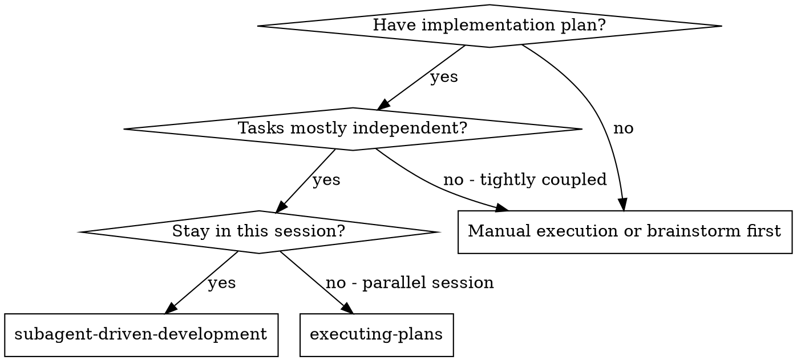
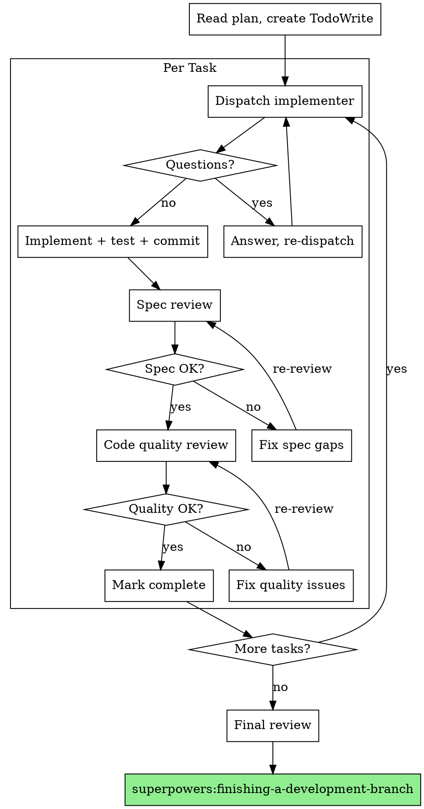

# Subagent-Driven Development

Execute plan by dispatching fresh subagent per task, with two-stage review after each: spec compliance review first, then code quality review.

**Core principle:** Fresh subagent per task + two-stage review (spec then quality) = high quality, fast iteration

## When to Use



## Workflow Detection

If `docs/tasks/<task-id>.yaml` exists and `status == execute`, this skill is running within `/run-ce-workflow`. In that case, the orchestrator manages state transitions — skip the final handoff to `finishing-a-development-branch` and instead set `stages.execute.all_checkpoints_done: true` and `stages.execute.all_tests_green: true` on completion.

## Workflow

1. Read the implementation plan and identify independent tasks.
2. Create a TodoWrite checklist with one item per task (and any session setup items).
3. For each task: dispatch an implementer subagent (after optional `AskQuestion` confirmation), then run spec review and code quality review loops until approved.
4. Review each subagent’s output; resolve `NEEDS_CONTEXT`, `BLOCKED`, or `DONE_WITH_CONCERNS` before moving on.
5. Integrate results across tasks, run final review, and verify (e.g. tests, workflow completion skills).

Create TodoWrite todos from this workflow (use task-scoped IDs, e.g. `sadd-{task}-1`):

```
TodoWrite todos:
  - id: "sadd-setup-1", content: "Read plan + list independent tasks", status: "pending"
  - id: "sadd-setup-2", content: "TodoWrite checklist created", status: "pending"
  - id: "sadd-task-1", content: "Task 1: dispatch → reviews → complete", status: "pending"
  - id: "sadd-final-1", content: "Final review + integrate + verify", status: "pending"
```

## The Process



### Task Start Confirmation

Before dispatching each implementation subagent, use the `AskQuestion` tool:

- **title:** "Task {N}: {task name}"
- **question prompt:** "Ready to dispatch implementation subagent for:\n{brief task description}"
- **options:**
  - "Proceed with this task"
  - "Skip this task"
  - "Reorder — do a different task next"
  - "Approve all remaining tasks without pausing"

If user selects "Approve all remaining tasks", skip `AskQuestion` for subsequent tasks. Still show task summaries before dispatching.

## Model Selection

Use the least powerful model that can handle each role.

| Task type                                         | Cursor `model` param | Signals                                   |
| ------------------------------------------------- | -------------------- | ----------------------------------------- |
| Mechanical implementation (1-2 files, clear spec) | `fast`               | Isolated function, well-specified         |
| Integration / judgment (multi-file, debugging)    | _(default)_          | Pattern matching, cross-file coordination |
| Architecture / design / review                    | _(default)_          | Broad codebase understanding needed       |

## Handling Implementer Status

Implementer subagents report one of four statuses. Handle each appropriately:

**DONE:** Proceed to spec compliance review.

**DONE_WITH_CONCERNS:** The implementer completed the work but flagged doubts. Read the concerns before proceeding. If the concerns are about correctness or scope, address them before review. If they're observations (e.g., "this file is getting large"), note them and proceed to review.

**NEEDS_CONTEXT:** The implementer needs information that wasn't provided. Provide the missing context and re-dispatch.

**BLOCKED:** The implementer cannot complete the task. Assess the blocker:

1. If it's a context problem, provide more context and re-dispatch with the same model
2. If the task requires more reasoning, re-dispatch with a more capable model
3. If the task is too large, break it into smaller pieces
4. If the plan itself is wrong, escalate to the human

**Never** ignore an escalation or force the same model to retry without changes. If the implementer said it's stuck, something needs to change.

## Prompt Templates

Read the prompt template files from this skill's directory and pass their content as the Task tool's `prompt` parameter:

- `./implementer-prompt.md` — Dispatch implementer subagent
- `./spec-reviewer-prompt.md` — Dispatch spec compliance reviewer subagent
- `./code-quality-reviewer-prompt.md` — Dispatch code quality reviewer subagent

## Example Workflow

| Step   | Action                                                     | Result                                           |
| ------ | ---------------------------------------------------------- | ------------------------------------------------ |
| Setup  | Read plan, extract all tasks, create TodoWrite             | 5 tasks queued                                   |
| Task 1 | Dispatch implementer → asks question → answer → implements | 5/5 tests passing, committed                     |
|        | Dispatch spec reviewer                                     | ✅ Spec compliant                                |
|        | Dispatch code quality reviewer                             | ✅ Approved                                      |
| Task 2 | Dispatch implementer → implements                          | 8/8 tests passing, committed                     |
|        | Dispatch spec reviewer                                     | ❌ Missing progress reporting, extra --json flag |
|        | Implementer fixes → spec reviewer re-reviews               | ✅ Spec compliant                                |
|        | Dispatch code quality reviewer                             | ❌ Magic number                                  |
|        | Implementer fixes → code quality re-reviews                | ✅ Approved                                      |
| ...    | Repeat for remaining tasks                                 |                                                  |
| Final  | Dispatch final code reviewer for entire implementation     | Ready to merge                                   |

## Red Flags

**Never:**

- Start implementation on main/master branch without explicit user consent
- Skip reviews (spec compliance OR code quality)
- Proceed with unfixed issues
- Dispatch multiple implementation subagents in parallel (conflicts)
- Make subagent read plan file (provide full text instead)
- Skip scene-setting context (subagent needs to understand where task fits)
- Ignore subagent questions (answer before letting them proceed)
- Accept "close enough" on spec compliance (spec reviewer found issues = not done)
- Skip review loops (reviewer found issues = implementer fixes = review again)
- Let implementer self-review replace actual review (both are needed)
- **Start code quality review before spec compliance is ✅** (wrong order)
- Move to next task while either review has open issues
- Forgetting to offer "Approve all remaining" — don't force user to click through every task if they trust the plan

**If subagent asks questions:**

- Answer clearly and completely
- Provide additional context if needed
- Don't rush them into implementation

**If reviewer finds issues:**

- Implementer (same subagent) fixes them
- Reviewer reviews again
- Repeat until approved
- Don't skip the re-review

**If subagent fails task:**

- Dispatch fix subagent with specific instructions
- Don't try to fix manually (context pollution)

## Integration

**Required workflow skills:**

- **superpowers:using-git-worktrees** — Set up isolated workspace before starting
- **superpowers:writing-arch-plans** / **superpowers:writing-impl-plans** — Creates the plan this skill executes
- **superpowers:requesting-code-review** — Code review template for reviewer subagents
- **superpowers:finishing-a-development-branch** — Complete development after all tasks

**Subagents should use:**

- **superpowers:test-driven-development** — Subagents follow TDD for each task

**Alternative workflow:**

- **superpowers:executing-plans** — Use for parallel session instead of same-session execution
